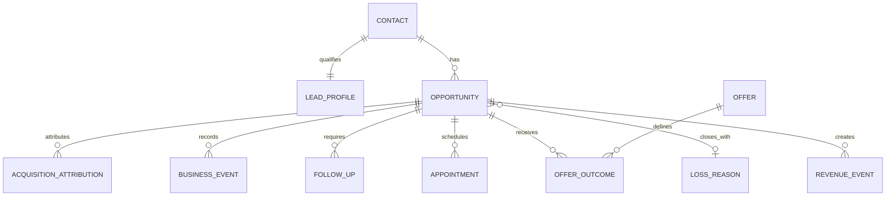

# Modelo de domínio proposto

## Decisão central

Manter `contacts` como identidade reutilizável e tratar `deals` como a oportunidade comercial inicial é possível, mas o domínio precisa de entidades auxiliares explícitas. Não usar `contact.status`, notas livres ou um Kanban com dezenas de colunas como fonte de verdade do funil.

**Recomendação:** uma oportunidade ativa por lead para o fluxo de psicoterapia inicial; um contato pode ter oportunidades posteriores de produto no futuro. O estágio mostra progresso irreversível predominante. Estados como maturação e follow-up permanecem propriedades operacionais.

## Pipeline inicial

| Estágio canônico | Significado | Evento que o confirma |
| --- | --- | --- |
| `new_lead` | Lead comercial recebido, ainda sem contato humano confirmado. | `lead_acquired` |
| `contact_started` | A clínica iniciou a primeira abordagem. | `contact_started` |
| `conversation_active` | Houve conversa ou resposta relevante. | `lead_replied` |
| `initial_session_scheduled` | Sessão inicial marcada. | `initial_session_scheduled` |
| `initial_session_paid` | Pagamento confirmado. | `initial_session_paid` |
| `initial_session_attended` | Sessão inicial ocorreu. | `initial_session_attended` |
| `continuity_offered` | Oferta de continuidade apresentada. | `continuity_offered` |
| `continuity_contracted` | Continuidade aceita/contratada. | `continuity_accepted` |
| `patient_active` | Início comercialmente confirmado. | `patient_activated` |
| `lost` | Oportunidade encerrada com motivo. | `lead_lost` |

`lost` é terminal para a oportunidade atual, mas uma reativação cria `lead_reactivated` e retorna a uma etapa definida. `initial_session_no_show` é evento e resultado de agendamento, não uma coluna de Kanban.

## Estados operacionais, não colunas do Kanban

| Propriedade | Valores sugeridos | Por quê |
| --- | --- | --- |
| `engagement_status` | `awaiting_lead`, `follow_up_due`, `maturing`, `paused`, `reactivated` | Transversal a qualquer estágio; evita duplicar o Kanban. |
| `next_action_type` | `message`, `call`, `confirm_schedule`, `payment_check`, `offer_follow_up`, `review` | Responde o que fazer. |
| `next_action_at` | timestamp opcional | Alimenta a fila de atenção. |
| `last_interaction_at` | timestamp | Alimenta aging sem depender da modificação de uma nota. |
| `lost_reason_id` | FK opcional | Obrigatório ao perder; configurável. |

O aging é derivado: `now() - stage_entered_at` e `now() - last_interaction_at`; não deve ser persistido como contador que pode divergir.

## Entidades propostas

| Entidade | Papel | Decisão |
| --- | --- | --- |
| `contacts` | Identidade, telefone/e-mail, responsável, tags. | Reusar e minimizar campos. |
| `lead_profiles` | Dados comerciais 1:1 do contato: origem geral, consentimento comercial, primeiro/último toque. | Nova tabela. |
| `opportunities` | Uma oferta/caminho comercial para um contato, estágio e estado operacional. | Evolução de `deals` ou tabela nova, a decidir na Fase 1 após protótipo de migração. |
| `acquisition_attributions` | UTM, Google Ads e landing page, com campos nulos permitidos. | Nova tabela 1:N com uma atribuição primária. |
| `business_events` | Fatos append-only com tipo, ocorrido em, ator, oportunidade, contato e payload mínimo validado. | Nova tabela. |
| `follow_ups` | Próxima ação, vencimento, estado, canal e conclusão. | Nova tabela; tarefas genéricas podem ser migradas/adaptadas. |
| `appointments` | Sessão inicial comercial: marcada, paga, compareceu/no-show. Sem conteúdo clínico. | Nova tabela. |
| `offers` | Catálogo configurável de sessão inicial, continuidade e produto futuro. | Nova tabela. |
| `offer_outcomes` | Oferta feita/aceita/recusada, valor e motivo. | Nova tabela leve. |
| `loss_reasons` | Motivos configuráveis e ativos/inativos. | Nova tabela. |
| `revenue_events` | Valor contratado, recebido, estornado/cancelado e data. | Nova tabela; não implementar pagamento. |

## Relações

## Dados de aquisição

Preservar, quando disponíveis, `source`, `medium`, `campaign`, `campaign_id`, `ad_group`, `ad_group_id`, `ad`, `ad_id`, `keyword`, `match_type`, `landing_page`, `utm_source`, `utm_medium`, `utm_campaign`, `utm_content`, `utm_term`, `gclid`, `acquired_at` e a origem da captura. Campos desconhecidos são `NULL`, nunca uma string sentinela como `unknown` que prejudica agregação.

Normalizar valores de fonte/canal no serviço de ingestão; manter o valor original quando necessário para auditoria técnica. `acquired_at` é imutável depois de confirmado e não pode ser substituído por `created_at`.

## Eventos e timestamps

Eventos candidatos: `lead_acquired`, `whatsapp_clicked`, `contact_started`, `lead_replied`, `initial_session_scheduled`, `initial_session_paid`, `initial_session_attended`, `initial_session_no_show`, `continuity_offered`, `continuity_accepted`, `continuity_declined`, `patient_activated`, `lead_lost`, `lead_reactivated`, `product_offered` e `product_purchased`.

Cada fato possui `occurred_at` (quando ocorreu), `recorded_at` (quando entrou no CRM), `source` (manual/import/integration), `actor_sales_id` opcional, chave de idempotência opcional e payload pequeno versionado. O estado atual da oportunidade é uma projeção transacional atualizada junto ao evento; analytics lê eventos e views, não o histórico de notas.

Manter separadas as datas `acquired_at`, `contact_started_at`, `scheduled_at`, `paid_at`, `attended_at`, `continuity_offered_at`, `converted_at` e `lost_at`. Isso preserva cohort de aquisição e tempo até conversão.

## Motivos de perda

Tabela configurável com códigos estáveis: `financial_capacity`, `price`, `value_not_perceived`, `not_now`, `no_response`, `chose_other_professional`, `no_fit`, `postponed`, `other` e `unknown`. O rótulo pode mudar; o código não. `other` exige nota comercial curta e `unknown` é permitido somente quando não houve informação suficiente.

## Minimização de triagem

O CRM pode receber somente identidade, contato, timestamp, intenção de agendar, origem e uma classificação comercial não clínica estritamente necessária. Não copiar respostas abertas, sintomas, intensidade, hipóteses diagnósticas, histórico ou anexos de saúde. Se a landing page precisar processar dado de saúde, ela deve ter armazenamento, base legal, acesso, retenção e controles separados do CRM comercial.
